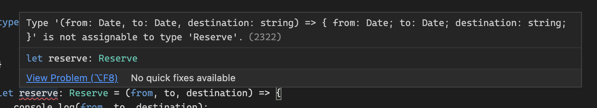

### \# 용어 소개

1. 매개변수 (parameter)
   - 함수 선언의 일부
   - 함수를 실행하는 데에 필요한 데이터 조각
   - 정형 매개변수(formal parameter)라고도 부름.
2. 인수 (argument)
   - 함수를 호출할 때 전달해야 하는 데이터 조걱
   - 실질 매개변수(actual parameter)라고도 부름.

### \# this

`this`를 사용하는 함수의 첫 번째 매개변수로 `this`의 타입을 정의하여 사용

```js
function fancyDate() {
  return `${this.getDate()}/${this.getMonth() + 1}/${this.getFullYear()}`;
}
fancyDate(); // 처리되지 않은 TypeError 발생
fancyDate.call(new Date()); // "4/10/2021"
```

```ts
function fancyDate(this: Date) {
  return `${this.getDate()}/${this.getMonth() + 1}/${this.getFullYear()}`;
}
fancyDate(); // Error TS2684: 타입스크립트가 에러를 터뜨린다.
fancyDate.call(new Date()); // "4/10/2021"
```

`tsconfig.json`의 `noImplicitThis` 속성을 `true`로 설정하면 this 타입을 명시하도록 (클래스와 객체의 메소드는 this를 제외하고) 강제할 수 있다.

### \# 제너레이터

```ts
function* createFibonacciGenerator(): IterableIterator<number> {
  let a = 0;
  let b = 1;
  while (true) {
    yield a;
    [a, b] = [b, a + b];
  }
}

let fibonacciGenerator = createFibonacciGenerator();
fibonacciGenerator.next();
fibonacciGenerator.next();
fibonacciGenerator.next();
```

- 용어 정리
  - iterable: Symbol.iterator라는 프로퍼티를 가진 모든 객체
  - iterator: next라는 메소드(value, done)을 정의한 객체

제너레이터 함수 호출시 `Symbol.iterator` 프로퍼티와 `next` 메소드를 모두 정의한 값을 얻게됨.

> 이터러블과 이터레이터 두 가지가 결합된 제너레이터가 반환됨.

```ts
let numbers = {
  *[Symbol.iterator]() {
    for (let i = 1; i <= 10; i++) {
      yield i;
    }
  }
};
```

- numbers는 이터러블 (Symbol.iterator를 가지고 있으니까.)

- 제너레이터 함수인 numbers의 Symbol.iterator를 호출하면 이터러블 이터레이터 반환됨.

  ```ts
  for (let a of numbers) {
    console.log(a);
  }
  // 1 2 3 4 5 6 .. 10

  let allNumbers = [...numbers];
  // [1 ~ 10]

  let [one, two, three, ...rest] = numbers;
  // [1, 2, 3, [4, 5, 6, ..., 10] ]
  ```

### \# 단축형 호출 시그니처 vs 전체 호출 시그니처

```ts
// 단축형 호출 시그니처
type Log = (message: string, userId?: string) => void;

// 전체 호출 시그니처
type Log = {
  (message: string, userId?: string): void;
};
```

- 두 코드는 같은 코드이다.
- 간단한 함수는 단축형을 활용하는 것이 좋고, 복잡한 함수는 전체 시그니처를 사용하는 것이 좋다.

```ts
type Reserve = {
  (from: Date, to: Date, destination: string): Reservation;
};

let reserve: Reserve = (from, to, destination) => {
  // ...
};
```

### \# 함수 오버로딩 (표현식)

- 타입스크립트는 입력(매개변수) 타입에 따라 달라지는 함수의 출력(반환) 타입을 정적 타입 시스템으로 각각 제공.

```ts
interface Reservation {
  from: Date;
  to: Date;
  destination: string;
}

type Reserve = {
  (from: Date, to: Date, destination: string): void;
  (from: Date, destination: string): void;
};

let reserve: Reserve = (from, to, destination) => {
  console.log(from, to, destination);
  return {
    from,
    to,
    destination
  };
};
```



- 타입스크립트에서 함수 오버로딩을 하는 경우에는 호출 시그니처 오버로딩을 처리하는 방식에 유의해야함.

- 타입스크립트는 `Reserve` 타입처럼 여러 개의 오버로드 시그니처 선언시 `호출자 관점`에서 reserve함수의 타입은 오버로드 시그니처의 `유니온`이 됨.
- 이 경우에는 타입스크립트가 추론이 불가능하기 때문에 reserve함수를 구현할 때 아래와 같이 구현부에서 직접 선언해야함.

```ts
interface Reservation {
  from: Date;
  to: Date | string;
  destination?: string;
}

type Reserve = {
  (from: Date, to: Date, destination: string): Reservation;
  (from: Date, destination: string): Reservation;
};

let reserve: Reserve = (from: Date, to: Date | string, destination?: string) => {
  console.log(from, to, destination);
  return {
    from,
    to,
    destination
  };
};
```

### \# 함수 오버로딩 (선언식)

- 브라우저 DOM API의 `document.createElement` 메소드를 예로 들자.

- 인자로 넘겨주는 문자열 값에 따라 다른 HTML 태그를 반환하는 메소드이다.

  ```ts
  // 함수 표현식 오버로딩
  type CreateElement = {
    (tag: 'a'): HTMLAnchorElement;
    (tag: 'div'): HTMLDivElement;
    (tag: 'table'): HTMLTableElement;
    // ...
    (tag: string): HTMLElement;
  };

  let createElement: CreateElement = (tag: string): HTMLElement => {
    // ...
  };
  ```

  ```ts
  function createElement(tag: 'a'): HTMLAnchorElement;
  function createElement(tag: 'div'): HTMLDivElement;
  function createElement(tag: 'table'): HTMLTableElement;
  function createElement(tag: string): HTMLElement;
  ```
